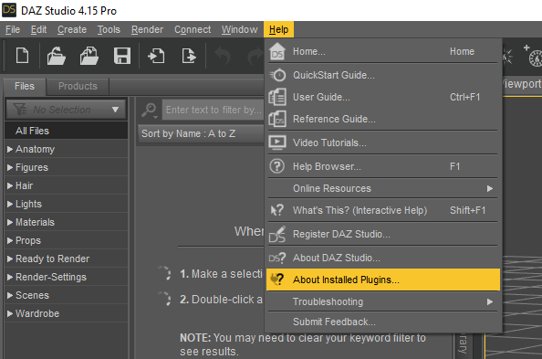
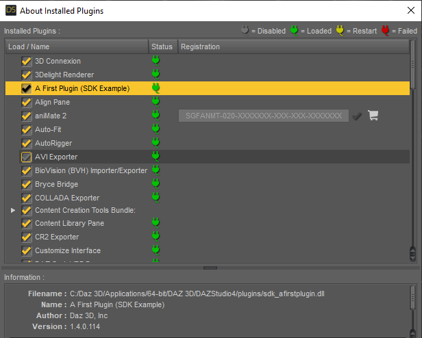
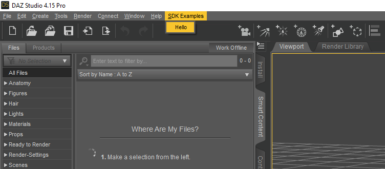

# Overview
- Are distributed as dynamically loaded libraries - `dll` files on Windows

# Install plug-ins
- Drop new plug ins in this folder `C:\Daz 3D\Applications\64-bit\DAZ 3D\DAZStudio4\plugins` and it will be loaded automatically when Daz Studio is started
- Open up Daz Studio and go to Help at the top. From the drop down menu click on About installed plugins. There should be a list of your plugins.

- You should see your plugin. In this example, it's `A First Plugin (SDK Example)

- Using the plugin. In this example, the plugin only said "Hello"

