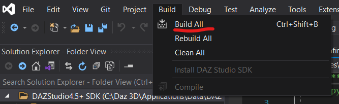

# Install Visual Studio 2019 Community version
Link [here](https://visualstudio.microsoft.com/vs/)

# Setup
- Open `Visual Studio Installer`
- Make sure `Desktop Development with C++` is checked

- Navigate to `C:\Daz 3D\Applications\Data\DAZ 3D\My DAZ 3D Library\DAZStudio4.5+ SDK` &rightarrow; sdk's root
- Right click the folder

- Click `Open with Visual Studio`
- Under Solution Explorer

- `docs`: Daz Studio SDK documentation
- `include`: C++ headers
- `lib`: C++ library
- `out`: Folder will be created once the project is built
- `samples`: Sample Plug-ins 

# Build
Click `Build All`

Output
- `out` folder under sdk's root
  - eg: Output of `samples\interface\AFirstPlugin` is
`out\build\x64-Debug\samples\interface\AFirstPlugin\sdk_afirstplugin.dll`