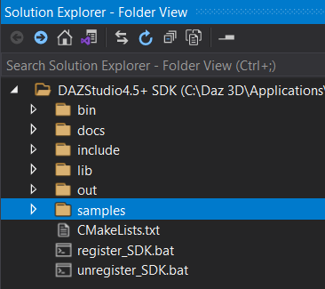

# Install Visual Studio 2019 Community version
Link [here](https://visualstudio.microsoft.com/vs/)

# Setup
- Open `Visual Studio Installer`
- Make sure `Desktop Development with C++` is checked

- Navigate to `C:\Daz 3D\Applications\Data\DAZ 3D\My DAZ 3D Library\DAZStudio4.5+ SDK` &rightarrow; sdk's root
- Right click the folder

- Click `Open with Visual Studio`
- Under Solution Explorer

- `docs`: Daz Studio SDK documentation
- `include`: C++ headers
- `lib`: C++ library
- `out`: Folder will be created once the project is built
- `samples`: Sample Plug-ins 

# Compiling DAZ Studio Plugins on Windows

- Click the arrow next to the dropdown
- Click `Manage Configurations` &rightarrow; this will open `CMakeSettings.json`

- In the table put in `C:/Daz 3D/Applications/64-bit/DAZ 3D/DAZStudio4` under the `Value` column next to `DAZ_STUDIO_EXE_DIR`
- Scoll all the way to the end and click `Show Advanced Settings`
- Under `CMakeGenerator`, change the drop down value to `Visual Studio 16 2019 Win 64`
- Hit `Ctrl+S` to save &rightarrow; this should also start the CMake build

- Go to `C:\Daz 3D\Applications\Data\DAZ 3D\My DAZ 3D Library\DAZStudio4.5+ SDK\out\build\x64-Debug` in your `Folder Explorer` &rightarrow; you should see `DAZ Studio SDK.sln`
- Open `DAZ Studio SDK.sln`